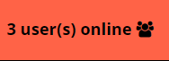
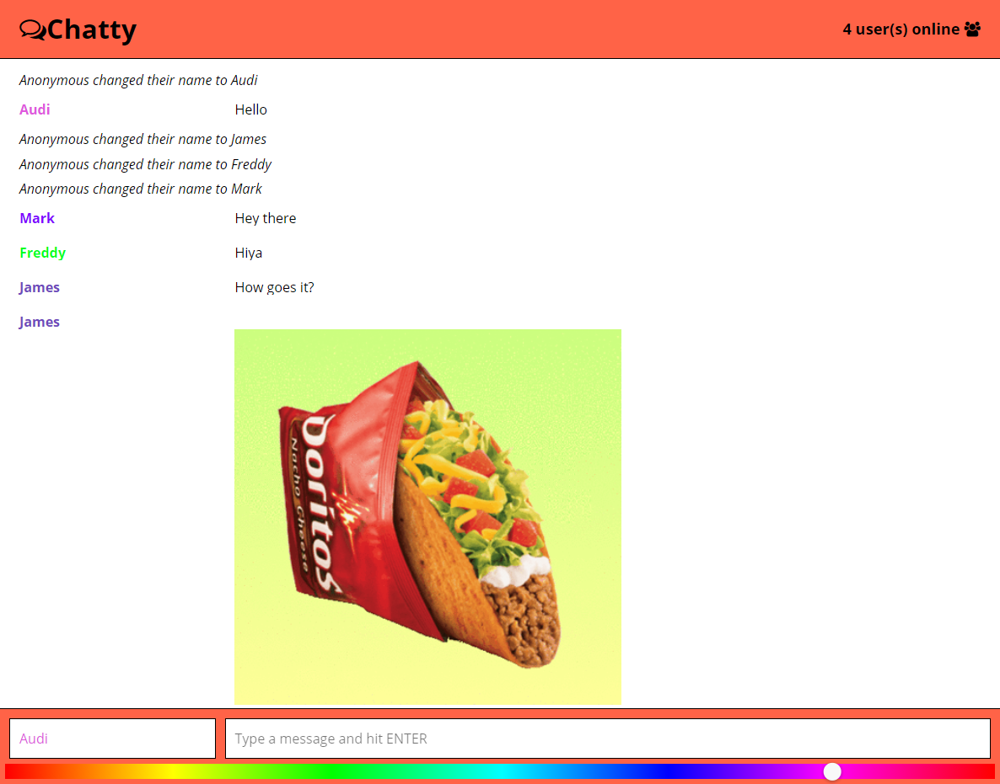

Chatty
======

A simple, single chat room app built using Webpack, ReactJS, WebSockets and Express.

## Usage

1. Clone the repo
2. Install the dependancies for both the client and the server

```
$ cd chatty-app
$ npm install
$ cd ../chatty-server
$ npm install
```

3. Start the server

```
$ cd chatty-server
$ npm start
```

4. Start the client

```
$ cd chatty-app
$ npm start
```

5. Load the client in your browser. By default, the address is: `http://localhost:3000`

### Features

- Send messages to other users by typing in the chat bar and hitting `enter/return`
- Change your username by entering a different name into the chat bar and hitting `enter/return`
- Change the colour of your username by selecting a different colour using the slider

  

- See the number of users currently connected in the top right

  

- Share giphys with others using the giphy command. Ex: `/giphy tacos`

  

- Paste image URLs to share images directly (.gif, .jpg, .png)

## Screenshots

  
